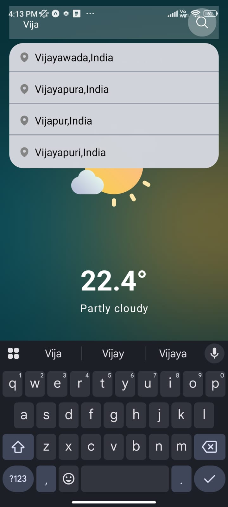
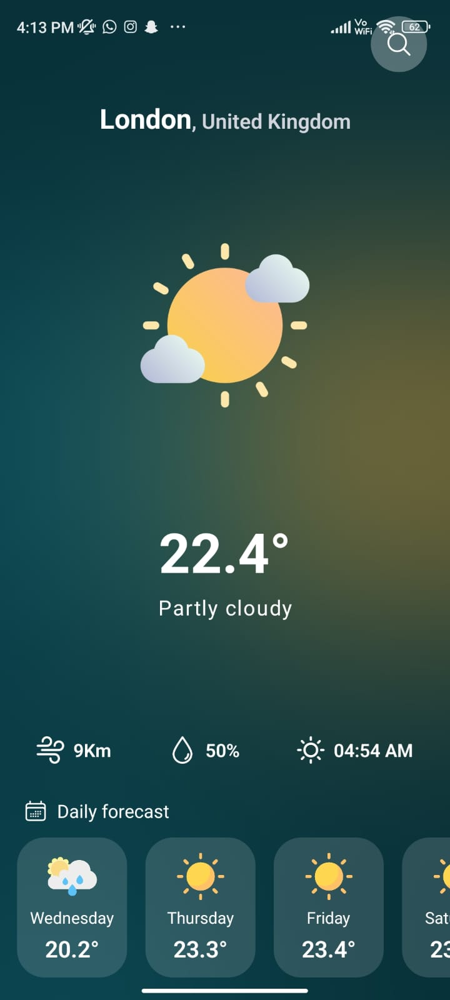

# WeatherTip - React Native Weather App

Welcome to **WeatherTip**, a sleek and intuitive weather application built with React Native! This app leverages the OpenWeatherAPI to provide real-time weather updates and a 5-day forecast, designed to offer a seamless user experience. As a job seeker, I’ve poured my passion for mobile development into this project, and I’m excited to share it with potential employers. Check out the live demo and code below!

## About the App

WeatherTip is more than just a weather app—it’s a showcase of my skills in React Native, API integration, and user interface design. The app allows users to:

- **Search for Locations**: Use the search bar to find cities and countries with smart recommendations.
- **Fetch Real-Time Data**: Enter a location to retrieve current weather details (temperature, conditions, etc.) from OpenWeatherAPI.
- **View Forecasts**: Get a 5-day weather prediction with daily highs and conditions.
- **Intuitive Design**: Enjoy a clean, responsive UI optimized for both iOS and Android.

The app dynamically fetches and displays weather data, as seen in the screenshots below, making it a practical tool for users worldwide.

## Features

- **Location Search with Autocomplete**: Type to see suggested cities and countries.
- **Real-Time Weather Updates**: Powered by OpenWeatherAPI for accurate, up-to-date information.
- **5-Day Forecast**: Plan ahead with daily weather insights.
- **Cross-Platform**: Fully functional on both iOS and Android devices.

<h3>Screenshots</h3>

  
  

## Demo Video

🎬 [Watch Demo Video](./assets/Working_demo.mp4) 
**Note:** When you click the video link, you'll be redirected to the file page. Click the **"View raw"** button to download the video.

## Tech Stack

- **Framework**: React Native
- **API**: OpenWeatherAPI
- **Version Control**: Git & GitHub
- **Development Tools**: Expo, Visual Studio Code

## Motivation
As a job seeker, I built WeatherTip to demonstrate my ability to create functional, user-friendly mobile applications. This project highlights my expertise in React Native, API integration, and problem-solving—skills I’m eager to bring to your team. I’m passionate about building apps that make a difference, and I’d love the opportunity to contribute to your projects!

## Future Improvements
- Add push notifications for weather alerts.

- Implement a dark mode toggle.

- Enhance the UI with animations and custom icons.

## Contact

I’m open to opportunities and collaborations!  
📧 Reach out to me at [saicharanchilla7777@gmail.com](mailto:saicharanchilla7777@gmail.com)  
🔗 Connect with me on [LinkedIn](https://www.linkedin.com/in/saicharan-chilla-2b2201271/)  
💻 Check out more of my work on [GitHub](https://github.com/228w1a1278)

